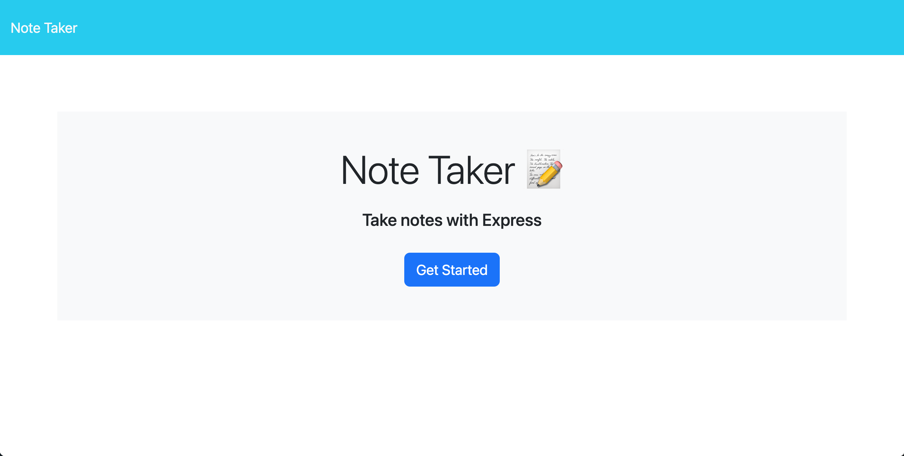
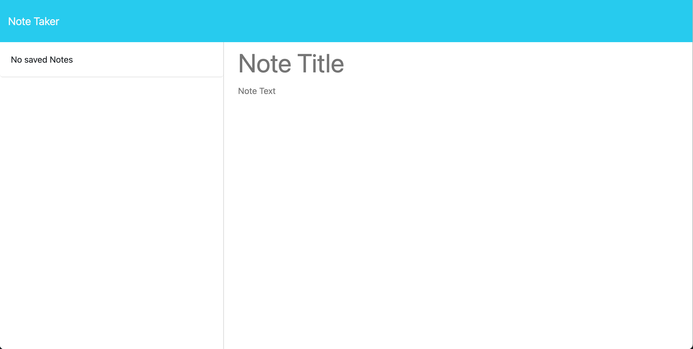
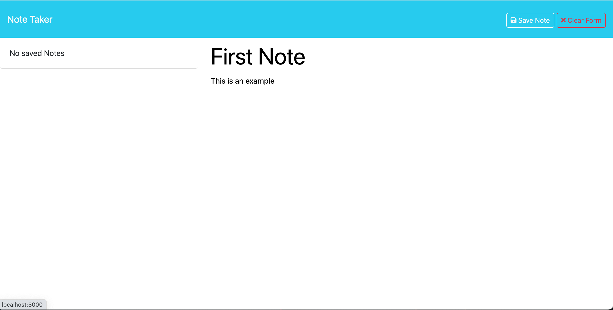
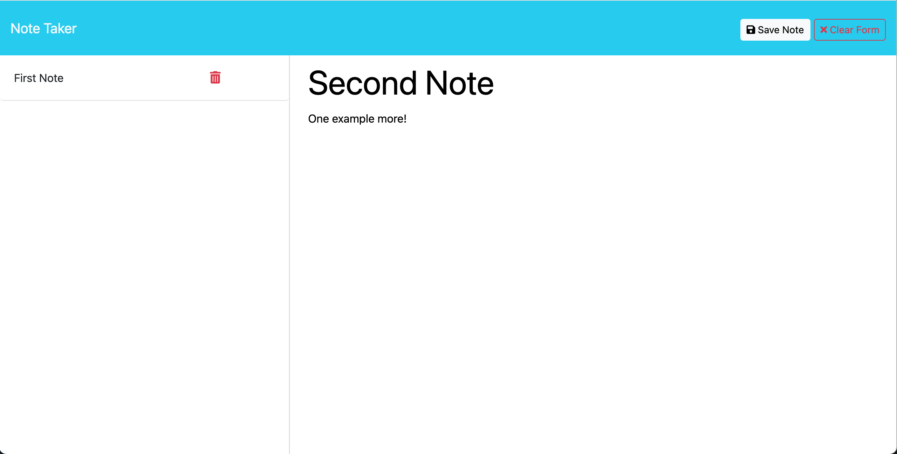
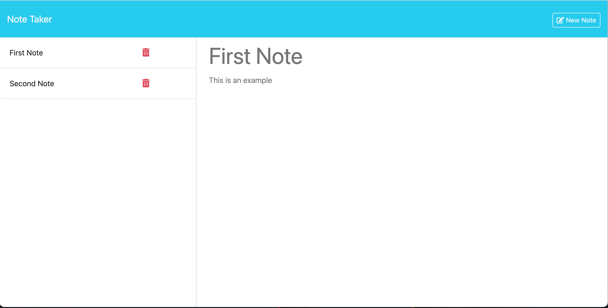
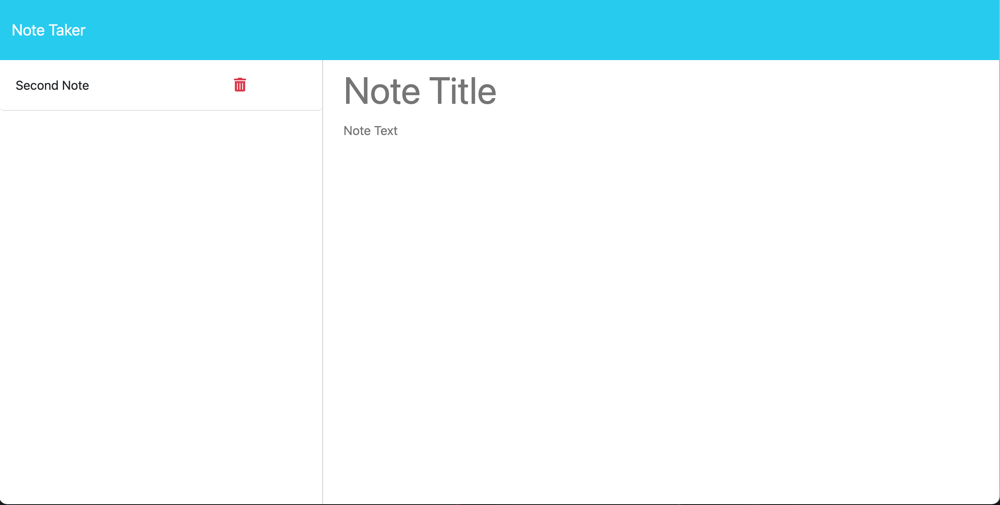

# Express-Note-Taker

## Description
This online Web application can be used to write and save notes.

[](https://opensource.org/licenses/MIT)

## Table of Contents:

- [Overview](#Overview)
- [The Challenge](#The-Challenge)
- [User Story](#User-Story)
- [Acceptance Criteria](#Acceptance-Criteria)
- [GIF](#GIF)
- [Installation Instructions](#Installation-Instructions)
- [Usage Instructions](#Usage-Instructions)
- [Technologies Used](#Technologies-Used)
- [Deployed Application Link](#Deployed-Application-Link)
- [Video Location](#Video-Location)
- [Screenshots](#Screenshots)
- [Test](#Test)
- [Questions](#Questions)
- [Credits](#Credits)
- [License](#License)

# Overview

## Challenge
"Modify starter code to create an application called Note Taker that can be used to write and save notes. This application will use an Express.js back end and will save and retrieve note data from a JSON file.

The application’s front end has already been created. It's your job to build the back end, connect the two, and then deploy the entire application to Heroku.

You haven’t learned how to handle DELETE requests, but this application offers that functionality on the front end. As a bonus, try to add the DELETE route to the application using the following guideline:

* `DELETE /api/notes/:id` should receive a query parameter that contains the id of a note to delete. To delete a note, you'll need to read all notes from the `db.json` file, remove the note with the given `id` property, and then rewrite the notes to the `db.json` file."

## User Story

```md
AS A small business owner
I WANT to be able to write and save notes
SO THAT I can organize my thoughts and keep track of tasks I need to complete.
```

## Acceptance Criteria

```md
GIVEN a note-taking application,
WHEN I open the Note Taker,
THEN I am presented with a landing page with a link to a notes page,
WHEN I click on the link to the notes page,
THEN I am presented with a page with existing notes listed in the left-hand column, plus empty fields to enter a new note title and the note’s text in the right-hand column,
WHEN I enter a new note title and the note’s text,
THEN a Save icon appears in the navigation at the top of the page,
WHEN I click on the Save icon,
THEN the new note I have entered is saved and appears in the left-hand column with the other existing notes,
WHEN I click on an existing note in the list in the left-hand column,
THEN that note appears in the right-hand column,
WHEN I click on the Write icon in the navigation at the top of the page,
THEN I am presented with empty fields to enter a new note title and the note’s text in the right-hand column.
```

## GIF

The following animation demonstrates the desired application functionality:


## Installation Instructions

This is an online Web Application deployed through Heroku, hence it doesn't need user's installation. 

## Usage Instructions
1. Open the web page using the link provided further in this README file, 
2. Click on the Get Started button, 
3. Write down a title and your note on the input field, 
4. Click the Save Note button.
5. Write down as many note as you want.
6. Open saved notes doing click on the note,
7. Delete notes clicking on the DELETE (trash can) button.

## Technologies Used
- Node.js [Version 16.18.1](https://nodejs.org/en/blog/release/v16.18.1/)
- Express.js [Version 4.16.4](https://expressjs.com/)
- Visual Studio Code: [Website](https://code.visualstudio.com/)

## Deployed Application Link
[Deployed Application Link:](https://lit-caverns-39901-b1b0838a840a.herokuapp.com/)

## Video Location
[Express Note Taker](https://drive.google.com/file/d/1r6-Jf42oFd49sn-jYlvYtPBdXlIjhpmq/view?usp=sharing)

## Screenshots







## Test
This application has been tested running it with Live Server localhost 3000, and also after deployment with Heroku.

## Questions?

If you have any questions related with this Express Note Taker, feel free to reach me through:

Email:[fibarrafdec@gmail.com](fibarrafdec@gmail.com)

GitHub username:[fibarrafdec](fibarrafdec)
GitHub link: https://github.com/fibarrafdec

## Credits
This application has been created by © 2023 Fernando Ibarra [fibarrafdec](https://github.com/fibarrafdec).

## License & Copyright ©
This application is covered under the MIT License.
[](https://opensource.org/licenses/MIT)

### Copyright © 2023 Fernando Ibarra
```md
Permission is hereby granted, free of charge, to any person obtaining a copy
of this software and associated documentation files (the "Software"), to deal
in the Software without restriction, including without limitation the rights
to use, copy, modify, merge, publish, distribute, sublicense, and/or sell
copies of the Software, and to permit persons to whom the Software is
furnished to do so, subject to the following conditions:

The above copyright notice and this permission notice shall be included in all
copies or substantial portions of the Software.

THE SOFTWARE IS PROVIDED "AS IS", WITHOUT WARRANTY OF ANY KIND, EXPRESS OR
IMPLIED, INCLUDING BUT NOT LIMITED TO THE WARRANTIES OF MERCHANTABILITY,
FITNESS FOR A PARTICULAR PURPOSE AND NONINFRINGEMENT. IN NO EVENT SHALL THE
AUTHORS OR COPYRIGHT HOLDERS BE LIABLE FOR ANY CLAIM, DAMAGES OR OTHER
LIABILITY, WHETHER IN AN ACTION OF CONTRACT, TORT OR OTHERWISE, ARISING FROM,
OUT OF OR IN CONNECTION WITH THE SOFTWARE OR THE USE OR OTHER DEALINGS IN THE
SOFTWARE.
```
